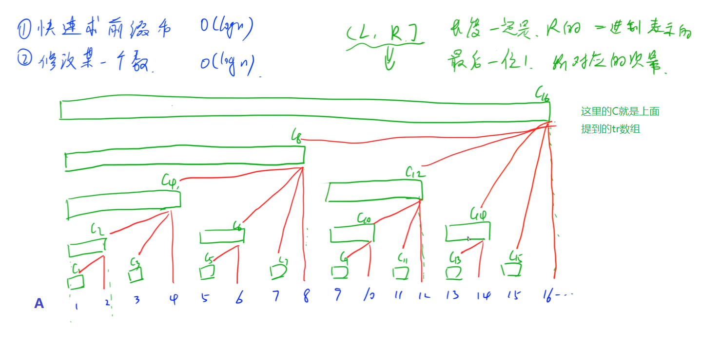

## 4.高级数据结构

### 4.1 并查集


### 4.2 树状数组

* 树状数组可以有两个操作：（1）快速求数组A前缀和；（2）修改数组A中某个数据。
* 上面两个操作的时间复杂度都是O(log(N))的

---

注意：下面所有的数组下标都是从1开始考虑的!!!

如果我们想求出A[1...x]区间和，我们可以根据x的二进制表示将该区间划分为若干部分，如果x的二进制表示如下：
$$
x = 2^{i_k} + 2^{i_{k-1}} + ... + 2^{i_1} \quad \quad i_k > i_{k-1}>...>i_1
$$
则可以将A[1...x]划分为如下区间：
$$
A(x-2^{i_1},..., x]  \quad \quad 该区间包含2^{i_1}个数据 \\
A(x-2^{i_1}-2^{i_2},..., x-2^{i_1}]  \quad \quad 该区间包含2^{i_2}个数据  \\
.  \\
.  \\
A(0,..., x-2^{i_1}-2^{i_2}-...-2^{i_{k-1}}]  \quad \quad 该区间包含2^{i_k}个数据  \\
$$
假设这样的区间我们已经知道了，那么我们在O(log(x))的时间里就可以将A[1...x]区间和求出来。

注意到对于上面被划分出来的各个区间，有：$2^{i_1}$ 是x的二进制表示的最后一位1；$2^{i_2}$ 是 $x-2^{i_1}$ 的二进制表示的最后一位1；以此类推。因此上述区间又可以写成如下通式，记为tr[R]：
$$
tr[R]=A[R-lowbit(x)+1,\ R]
$$
所以有：
$$
A[1...x] = tr[x] + tr[x-lowbit(x)]+tr[y-lowbit(y)]+... \quad \quad 其中y=x-lowbit(x)
$$


我们可以把tr看成一棵树，那么现在有两个问题：（1）如何找到某个节点的所有儿子；（2）如何找到某个节点的父亲。

（1）寻找tr[x]的儿子：A[x]，tr[x-1]，tr[x-1-lowbit(x-1)]，...。如果x=0b......100...000（这里的1是从左网游最后一个1），儿子对应二进制就是：A[x]，tr[0b......011...111]，tr[0b......011...110]，...，tr[0b......010...000]

（2）寻找tr[t]的父亲：tr[t+lowbit(t)]。这个可以由（1）看出来，如果父节点x=0b......100...000，子节点必定是t=0b......011......这种形式(1是连续的)，由t可以反向可以推出来x，即x = t + lowbit(t)。

```c++
int n;  // 数组中元素个数
int a[N];  // 原数组，a[1...n]为有效元素
int tr[N];

int lowbit(int x) {
    return x & -x;
}

// 操作原数组，让a[x] += c;
void add(int x, int c) {
    for (int i = x; i <= n; i += lowbit(i)) tr[i] +=c;
}

// 获得a[1...x]的区间和
int sum(int x) {
    int res = 0;
    for (int i = x; i; i -= lowbit(i)) res += tr[i];
    return res;
}

// 树状数组的初始化，有很多方式，如下
// 时间复杂度：O(n*log(n))
void init() {
    for (int i = 1; i <= n; i++) add(i, a[i]);
}
// 时间复杂度：O(n)
void init() {
    for (int i = 1; i <= n; i++) {  // 求tr[i]
        tr[i] = a[i];
        for (int j = i - 1; i > i - lowbit(i); i -= lowbit(x))  // 遍历tr[i]的孩子
            tr[i] += tr[j];
    }
}
// 另外还可以根据tr的定义去算，先求出a的前缀和s，然后求出tr：tr[x] = s[x] - s[x-lowbit(x)]。时间复杂度：O(n)
```

[AcWing 0241. 楼兰图腾](https://www.acwing.com/problem/content/243/)


